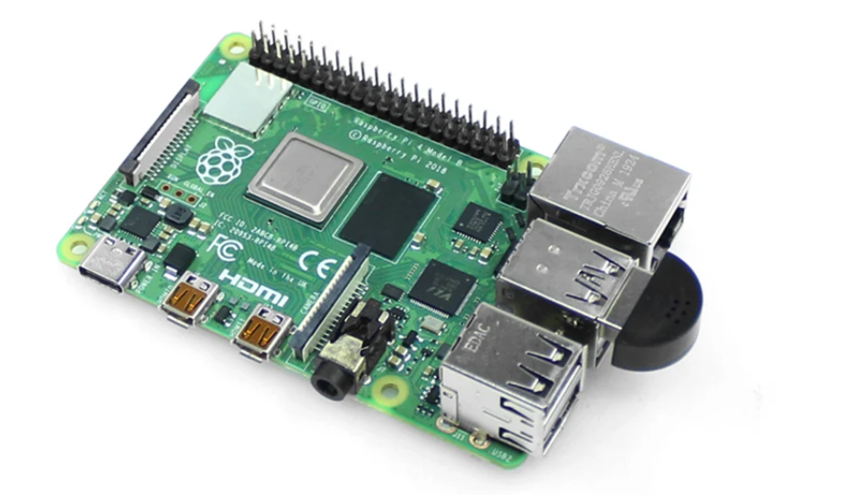

# Pi Sound Sensing

Embedded general purpose, real-time sound recognition demo:



Welcome to our project's GitHub repository! Our work focuses on exploring the potential of audio event recognition using convolutional neural networks on edge devices, like Raspberry Pi, aiming to achieve real-time audio analysis and classification.

Experience audio event detection on a low-cost device with our DIY project using pre-trained neural networks. Our software allows you to configure an email address to receive notifications when specific sound events are detected. Select from a list of available sound events from available on [this list](https://github.com/gbibbo/pisoundsensing/blob/main/sed_demo/assets/audioset_labels.csv), sourced from [AudioSet](https://research.google.com/audioset/), Google's comprehensive audio dataset. This experiment provides an easy way for users of all skill levels to set up automatic sound event detection. Simply follow the steps to deploy the pre-trained models on your device and start receiving notifications for the events you choose to monitor. Explore this fun and accessible introduction to audio machine learning!

**This is a newer version. The original version can be found at [this branch](https://github.com/yinkalario/General-Purpose-Sound-Recognition-Demo)**

## Authors

This software is based on the AI4S demo created as part of the AI4S project at the University of Surrey. If you use our work, please consider citing us:

[1] Gabriel Bibbó, Arshdeep Singh, Mark D. Plumbley. "Audio Tagging on an Embedded Hardware Platform" arXiv preprint arXiv:2306.09106 (2023).

Paper: https://arxiv.org/abs/2306.09106


## Hardware Prerequisites:

* Raspberry Pi 4 or higher.
* Micro SD card, 32GB or higher.
* Plug-and-play USB microphone, [like this one](https://thepihut.com/products/mini-usb-microphone)

# Installation

## Step 1: Prepare the microSD Card with the Operating System 

#### 1. Download the Operating System: 
Download the latest version of Raspberry Pi OS (64-bit) with desktop from the official website: [Raspberry Pi OS](https://www.raspberrypi.org/software/operating-systems/)

#### 2. Download Imaging Software: 
Download and install the [Raspberry Pi Imager](https://www.raspberrypi.org/software/) software.

#### 3. Burn the Image to the microSD Card: 
Insert the microSD card into your computer using a card reader. 

Open the Raspberry Pi Imager. 

Select the operating system image you downloaded and the microSD card as the destination. 

Click on "Write" and wait for the process to complete. 

#### 4. Verify the Burn: 

Once the burn is complete, verify that you can see the ‘boot’ partition on the microSD card using your file explorer. 

#### 5. Initial Configuration (optional): 

For easier access, you can enable SSH by placing a file named ‘ssh’ (with no extension) in the boot partition. 

You can also configure Wi-Fi by creating a file named ‘wpa_supplicant.conf’ in the boot partition and adding your network information. 

#### 6. Insert the microSD Card into the Raspberry Pi: 

Eject the microSD card from your computer and insert it into the Raspberry Pi. 

Connect the keyboard, mouse, monitor, and finally, the power supply to power on the Raspberry Pi. 

 

## Step 2: Initial Setup of the Raspberry Pi 

  

#### 1. Welcome Screen: 

When you power on your Raspberry Pi for the first time, the "Welcome to Raspberry Pi" application will pop up. 

#### 2. Set Localization Preferences: 

 Click "Next" to start the setup. 

Set your Country, Language, and Timezone, then click "Next" again. 

#### 3. Create User: 

Enter the username `ai4s`. 

It's advisable to change the default password for security purposes. Enter a new password and confirm it, then click "Next". 

#### 4. Connect to Wi-Fi: 

If you are using a Wi-Fi connection, select your Wi-Fi network from the list and enter the password. 

#### 5. Update Software: 

It's a good practice to update the software to the latest version. Click on "Update" to start the update process. This may take a while. 

#### 6. System Reboot: 

Once the updates are complete, reboot your Raspberry Pi by clicking "Restart". 

#### 7. Desktop Environment: 

After rebooting, you'll be taken to the desktop environment where you can start using your Raspberry Pi.  

 

## Step 3: Download and Execute the Installation Script 

 
#### 1. Download the Installation Script: 

Open the Terminal on your Raspberry Pi. 

Use the following command to download the `setup.sh` file from the GitHub repository: 

 
```bash
wget https://github.com/gbibbo/pisoundsensing/raw/main/setup.sh 
```
 

#### 2. Move the File and Prepare for Execution: 

Move the downloaded file to the `home/ai4s` folder with the command 
```bash
mv setup.sh ~/ai4s/ 
```
 

#### 3. Change to the directory where you moved the file: 
```bash
cd ~/ai4s/ 
```
 

#### 4. Execute the Installation Script: 
```bash
chmod +x setup.sh 
```
#### 5. Start the installation by executing the script with bash: 
```bash
bash setup.sh 
```
#### 6. During the Process: 

Stay attentive to the terminal. You will be asked to confirm the installation of some packages. When this happens, type `Y` and press `Enter` to continue. 

#### 7. Wait for Automatic Reboot 

Once the installation is complete, the Raspberry Pi will automatically reboot. This step is crucial to ensure that all changes and updates are applied correctly. 

## Step 4: Accessing the Graphical Interface: 

On a computer connected to the same WiFi network, open a web browser. 

Enter the address `piss.local` in the address bar. 

You should now be able to see and access the graphical interface of the device and start using the installed software. 
